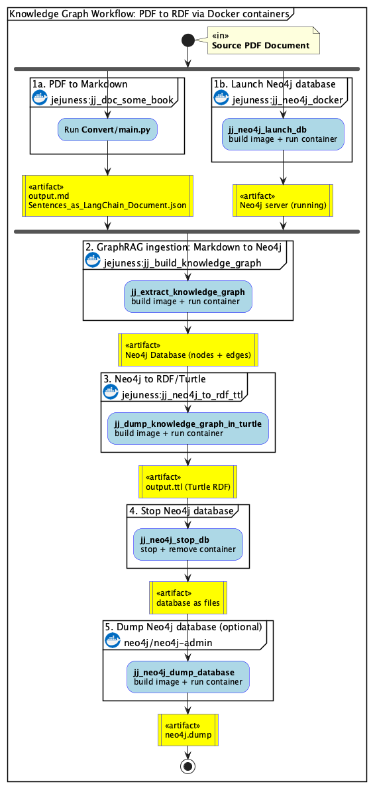

# A set of shell level utilities when working in jejuneness<!-- omit in toc -->

## Table of content<!-- omit in toc -->

- [Introduction](#introduction)
- [Usage](#usage)
- [Notes and warnings](#notes-and-warnings)

## Introduction

Data pipeline from PDF documents to a knowledge graph (as an RDF/Turtle file), implemented as a chain of Docker container invocations.

### Activity Diagram



Note: above image was generated from [workflow.puml](./Doc/workflow.puml) with `java -jar plantuml.jar -tpng workflow.puml`.

### Pipeline Summary

| Stage | Shell Function | Docker Image | Input | Output |
| ----- | -------------- | ------------ | ----- | ------ |
| 1a. PDF to Markdown | (external: `jj_doc_some_book`) | — | PDF | `.md` + `.json` |
| 1b. Launch Neo4j | `jj_neo4j_launch_db` | `jejuness:jj_neo4j_docker` (built from [`jj_neo4j_docker`](https://github.com/EricBoix/jj_neo4j_docker)) | — | Neo4j server |
| 2. Markdown to Neo4j | `jj_extract_knowledge_graph` | `jejuness:jj_build_knowledge_graph` (built from [`jj_build_knowledge_graph`](https://github.com/EricBoix/jj_build_knowledge_graph)) | `.md` + `.json` | Neo4j DB |
| 3. Neo4j to RDF | `jj_dump_knowledge_graph_in_turtle` | `jejuness:jj_neo4j_to_rdf_ttl` (built from [`jj_neo4j_to_rdf_ttl`](https://github.com/EricBoix/jj_neo4j_to_rdf_ttl)) | Neo4j DB | `.ttl` |
| 4. Stop Neo4j | `jj_neo4j_stop_db` | — | — | — |

## Usage

Let us assume you are working in the `cwd_dir` where you wish to use/invoke the `jj_workflow_shell` utilities

### Fetch the workflow utilities

```bash
git clone https://github.com/EricBoix/jj_workflow_shell.git   # This repository
source jj_workflow_shell/treatments.sh 
```

### Configure the shell utilities

Copy the `jj_workflow_shell/env-reference` file to a new `.env` file (located in the `cwd_dir` directory) and customize the environment variables values of `.env` in order to suit your needs

```bash
cp jj_workflow_shell/env-reference .env
```

Note that some variables are only required by some `jj_<command>`.
For example the `LLM_*` variables are only required when using [`jj_extract_knowledge_graph`](./treatments.sh).

### Use the commands

```bash
jj_neo4j_launch_db  --help
jj_extract_knowledge_graph  --help
jj_dump_knowledge_graph_in_turtle --help
jj_neo4j_dump_database --help
jj_neo4j_restore_database --help
jj_neo4j_stop_db --help
```

## Notes and warnings

### Concerning neo4j database

- **WARNING**: the username/password given to the neo4j database are only **initial** values (valid when starting the database for the first time). Once the neo4j db has been initialized those values are "burned" into the `database` files...
- There seems to be many caveats with the name of a neo4j dump, among which
  - the [neo4j-admin](https://neo4j.com/docs/operations-manual/current/neo4j-admin-neo4j-cli/) utility does not allow to provide the filename of the dump.
  - when restoring some dump, the provided database name must have a length between 1 and 63 characters.
  - a neo4j username/password are part of/burnt into the dump and cannot be overwritten. When dumping a neo4j DB one must keep the (dump, username, password) triplet.
